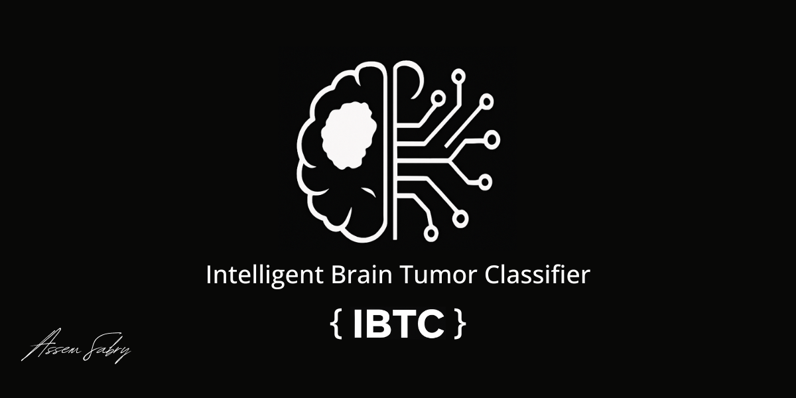

# Intelligent Brain Tumor Classifier (IBTC)

## Overview

The Intelligent Brain Tumor Classifier (IBTC) is a deep learning model designed to classify brain tumor types from medical images. The model leverages the power of convolutional neural networks, data augmentation, and transfer learning using ResNet50 architecture. This project is built for medical research purposes to assist in early and accurate classification of brain tumor conditions.

## Model Architecture

* **Base Model**: ResNet50 (pretrained on ImageNet)
* **Fine-Tuning**: Final layers of ResNet50 are unfrozen for training
* **Augmentation**: Utilizes MixUp and extensive image transformation techniques
* **Loss Function**: CrossEntropyLoss with MixUp criterion
* **Optimizer**: AdamW
* **Scheduler**: ReduceLROnPlateau

## Dataset

Due to the sensitivity and confidentiality of the medical data used, the training and evaluation datasets are **private and not publicly disclosed**. All datasets were prepared to reflect real-world variability and include multiple brain tumor categories.

* Training Samples: 4856
* Validation Samples: 856
* Number of Classes: 4 (undisclosed categories)

## Training Details

* Total Epochs: 30
* Batch Size: 32
* Input Size: 256x256
* Data Augmentation: Horizontal/Vertical Flip, Rotation, Affine Transformations, Color Jitter

## Results

Evaluation results and classification performance will be updated after the testing phase is finalized.

## Directory Structure

```
├── Media
│   └── banner.png
├── train.py
├── test.py
├── requirements.txt
└── README.md
```

## Usage

1. Clone the repository:

```bash
git clone https://github.com/yourusername/IBTC.git
cd IBTC
```

2. Install dependencies:

```bash
pip install -r requirements.txt
```

3. Train the model:

```bash
python train.py
```

## Requirements

* Python 3.8+
* PyTorch
* torchvision
* scikit-learn
* TensorBoard

You can find all dependencies listed in the `requirements.txt` file.

## Disclaimer

This project is strictly for **research and educational purposes**. It is not intended for clinical use or diagnosis without proper validation by medical professionals.

## Developer

**Assem Sabry**
AI Engineer
Focused on developing advanced AI models in the **medical imaging** domain and **natural language processing**. Dedicated to applying machine learning for real-world impact, especially in healthcare.

## License

This repository and its content are licensed for academic and research use only. For more information, refer to the LICENSE file.
